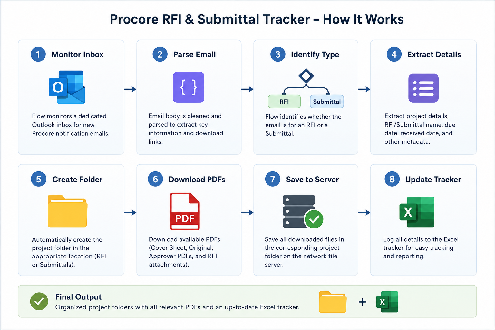

# Procore Submittal and RFI Tracker

> Automatically capture Procore Submittal and RFI email notifications, organise project folders, download available project PDFs, and maintain a structured Excel tracker without manual data entry. Built with Microsoft Power Automate for structural engineering workflows.

Built by a structural engineer, this Power Automate workflow monitors Outlook for incoming Procore action-required notifications and automatically classifies each email as either an RFI or a Submittal. It extracts project metadata, creates project folders on a network file server, downloads available Cover Sheets and RFI attachments, and maintains a searchable Excel tracker hosted on OneDrive or SharePoint.

No coding is required to use this workflow. Simply import the Power Automate package, connect your Microsoft 365 accounts, configure the File System connector (if saving PDFs to a network drive), and point the flow to your Excel tracker.

---

## Why I Built This

As a structural engineer, I was spending time manually tracking RFIs and submittals, creating project folders, downloading PDFs, and updating spreadsheets. Individually, these tasks were small, but together they consumed dozens of hours each year.

Instead of repeating the same administrative work for every project, I built a Power Automate workflow that automates the entire intake process—from the moment a Procore notification arrives to organising project documents and updating the tracker.

The result is a searchable, organised project record that stays up to date with virtually no manual data entry.

---

## Workflow Overview

The flow monitors Outlook for incoming Procore notifications, automatically classifies each email as either an RFI or a Submittal, extracts project metadata, organises project folders, downloads available PDFs, and maintains an up-to-date Excel tracker.

---

## Architecture

The workflow is composed of two independent processing pipelines:

- **RFI Processing**
  - Parse email
  - Extract metadata
  - Create project folder
  - Download cover sheet
  - Download available RFI attachments (works when Procore exposes the attachment URL in the email)
  - Update Excel tracker

- **Submittal Processing**
  - Parse email
  - Extract metadata
  - Create project folder
  - Download cover sheet
  - Update Excel tracker
  - Detect Original and Approver PDFs (authentication dependent)

---

## What It Does

Every time Procore sends an Action Required notification, the flow automatically:

1. Detects whether the email is an RFI or a Submittal.
2. Extracts project information and due dates.
3. Checks for duplicate notifications.
4. Creates the appropriate project folder.
5. Downloads the Cover Sheet PDF.
6. Downloads available RFI attachments when Procore exposes the attachment URL in the email.
7. Records the notification in the Excel tracker.
8. Detects Original and Approver PDFs for future authenticated download support.

---

## Features

### Email Processing

- Automatic Outlook monitoring
- Automatic RFI detection
- Automatic Submittal detection
- Automatic metadata extraction
- Duplicate prevention

### File Management

- Automatic project folder creation
- Automatic RFI folder creation
- Automatic Submittal folder creation
- Automatic cover sheet and attachment download

### Tracking

- Excel logging
- Structured folder organisation
- No coding required

### Current Limitations

- Original Submittal PDFs require authenticated Procore access
- Approver PDFs require authenticated Procore access
- RFI Attachments work only when Procore exposes the attachment URL in the email

---

## Requirements

You need the following before setting this up:

- **Microsoft Outlook** (Microsoft 365) -- the flow monitors an Outlook folder for incoming Procore emails
- **Power Automate** (Microsoft 365) -- where the flow runs
- **OneDrive or SharePoint** -- where the Excel tracker file is hosted; the flow reads from and writes to this file
- **A Procore account** -- the flow is designed around the email format that Procore sends for action-required notifications; it will not work with other project management tools
- **The Excel tracker file** -- a pre-configured `.xlsx` file with Table1 (Submittals) and Table2 (RFIs) already set up; a blank template is included in this repository
- **On-premises data gateway / File System connector** -- required if saving PDFs to a local or network file server.
- **Network folder mapping table** -- required if using automatic folder creation and PDF saving; the Excel tracker must include project-specific folder paths.

---

## Excel Tracker Structure

The tracker file has two sheets:

**Sheet 1 -- Submittals (Table1)**

| Column | Source |
|---|---|
| Project Number | Extracted from Procore email |
| Project Name | Extracted from Procore email |
| Submittal Name | Extracted from Procore email |
| Date Received | Date the email arrived |
| Due Date | Extracted from Procore email body |

**Sheet 2 -- RFIs (Table2)**

| Column | Source |
|---|---|
| Project Number | Extracted from Procore email |
| Project Name | Extracted from Procore email |
| RFI Number | Extracted from Procore email |
| RFI Name | Extracted from Procore email |
| Date Received | Date the email arrived |
| Due Date | Extracted from Procore email body |

Download the blank tracker template from this repository and upload it to your OneDrive or SharePoint before importing the flow.

---

## Installation

### Step 1 -- Download the files

Download both files from this repository:
- `ProcoreRFI&SubmittalTracker.zip` -- the Power Automate flow package
- `Tracker.xlsx` -- the blank Excel tracker template

---

### Step 2 -- Upload the Excel tracker

Upload `Tracker.xlsx` to your OneDrive or a SharePoint document library. Note the location -- you will need to point the flow at this file during setup.

---

### Step 3 -- Import the flow into Power Automate

1. Go to [make.powerautomate.com](https://make.powerautomate.com)
2. In the left sidebar, click **My flows**
3. Click **Import** at the top -> **Import Package (Legacy)**
4. Upload `ProcoreRFI&SubmittalTracker.zip`
5. On the import screen, review each resource and click the wrench icon to connect your own accounts:
   - **Outlook connection** -- connect to your Microsoft 365 account
   - **Excel Online (Business) connection** -- connect to your Microsoft 365 account
   - **File System connection** -- connect through the on-premises data gateway if saving PDFs to a network drive
6. Click **Import**

---

### Step 4 -- Connect the flow to your Outlook folder

Procore action emails may land in different places depending on your Outlook setup:

- **If you have Outlook rules routing Procore emails to a specific folder:** open the flow, find the trigger step (named "When a new email arrives"), and change the folder from Inbox to the correct project or Procore folder.
- **If you have no Outlook rules:** leave the trigger pointed at the Inbox. The flow will process all incoming emails and skip any that are not from Procore.

---

### Step 5 -- Connect the flow to your Excel tracker

1. Open the imported flow and click **Edit**
2. Find the steps named **Add a row into a table -- Submittals** and **Add a row into a table -- RFIs**
3. In each step, update the **Location**, **Document Library**, **File**, and **Table** fields to point at the `Tracker.xlsx` file you uploaded in Step 2
4. Save the flow

---

### Step 6 -- Turn the flow on and test

1. Toggle the flow to **On**
2. Ask a colleague to submit or respond to an RFI on one of your Procore projects, or wait for the next incoming Procore action email
3. Check the Excel tracker -- a new row should appear within a minute or two of the email arriving

---

## Important Notes

**Procore email format dependency.** This flow is built around the specific email format that Procore uses for "Action Required" notifications. If Procore changes its email format, expressions in the flow may need to be updated.

**Outlook folder monitoring.** Power Automate can only monitor one Outlook folder per trigger. If your Outlook routes Procore emails to multiple project-specific folders using rules, you will need either a separate flow for each folder or a consolidated folder that all Procore emails pass through. This is a known limitation of the current setup.

**Duplicate detection.** The flow checks for duplicates before adding a row. For submittals, it checks the Submittal Name plus the Project Name. For RFIs, it checks the RFI Number plus the Project Name. If the same notification arrives twice (which can happen when multiple team members are copied), it will not create a duplicate row.

**This is a reference implementation.** The flow was built and validated against my firm's Procore and Outlook setup. Variable names, folder paths, and email parsing expressions may need to be adjusted for your environment.

---

## Project Status

### ✅ Implemented

- Outlook monitoring
- Email parsing
- Metadata extraction
- Duplicate detection
- RFI processing
- Submittal processing
- Automatic folder creation
- Cover Sheet download
- RFI attachment download (when exposed)
- Excel tracking

### 🚧 In Progress

- Authenticated Original Submittal downloads
- Authenticated Approver PDF downloads

### 🔮 Future Enhancements

- Procore API integration
- Teams Planner integration instead of Excel
- Teams notifications
- SharePoint integration
- Dashboard reporting
- AI-assisted document classification

---

## Known Limitations

This project intentionally relies only on Procore notification emails and standard Microsoft 365 connectors.

Because Original Submittal PDFs and Approver PDFs are served behind authenticated Procore sessions, they cannot currently be downloaded using the standard Power Automate HTTP connector. These downloads are planned for a future Procore API or authenticated session implementation.

RFI attachments are downloaded only when the attachment URL is included in the notification email. Attachments added after the email is sent cannot be retrieved without the Procore API.

For API-based downloads, the Procore company that owns the project must authorise the app and grant the required permissions. If your firm is only a collaborator on another company's Procore project, email-based automation may be the most practical approach.

---

## About

Built by **Vibhanshu Mishra, PE** -- Structural Engineer at AG&E Structural Engenuity, Austin, TX.

Specialising in steel and mission-critical structures. Building practical automation tools that eliminate repetitive tasks in structural engineering workflows. 

- 🔗 [RISA-3D MCP Server](https://github.com/vibhanshu-mishra/risa3d-mcp-server) — Connect Claude AI to your RISA-3D structural models
- 🔗 [Tekla Structural Designer MCP Server](https://github.com/vibhanshu-mishra/tsd-mcp) — Connect Claude AI to your TSD structural models
- 💼 Connect on [LinkedIn](https://www.linkedin.com/in/vibhanshu9/)
